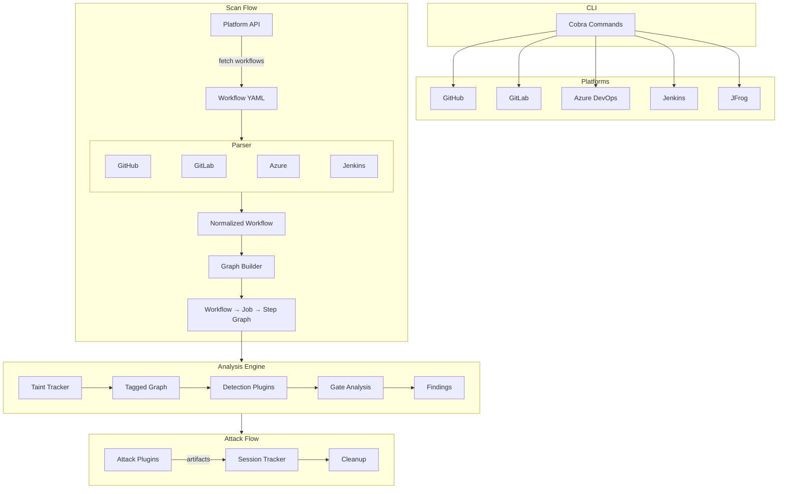

# Trajan: CI/CD Security Scanner

Trajan scans CI/CD pipelines for security vulnerabilities that attackers use to compromise software supply chains. It supports GitHub Actions, GitLab CI, Azure DevOps, Jenkins, and JFrog.

[](https://go.dev/)
[](LICENSE)

## What it does

Trajan parses workflow YAML files, builds dependency graphs, runs detection plugins, and validates exploitability through built-in attack capabilities.

- 32 detection plugins across multiple CI/CD platforms
- 24 attack plugins across multiple CI/CD platforms
- Graph-based analysis with taint tracking and gate detection
- Browser-based scanner via WebAssembly (no backend needed)
- Attack chains for multi-stage sequences with automatic context passing

> [!NOTE]
> Trajan is under active development. Some features may be incomplete and rough edges are expected. If you run into issues, please [open one](https://github.com/praetorian-inc/trajan/issues).

## Installation

Prebuilt binaries are available on the [releases page](https://github.com/praetorian-inc/trajan/releases).

```sh
go install github.com/praetorian-inc/trajan/cmd/trajan@latest
```

Or build from source:

```sh
git clone https://github.com/praetorian-inc/trajan.git
cd trajan && make build
```

## Quick usage

```sh
# Scan a GitHub repo
export GH_TOKEN=ghp_your_token
trajan github scan --repo owner/repo

# Scan a GitHub org
trajan github scan --org myorg --concurrency 20

# Scan GitLab projects
export GITLAB_TOKEN=glpat_your_token
trajan gitlab scan --group mygroup

# Scan Azure DevOps
export AZURE_DEVOPS_PAT=your_pat
trajan ado scan --org myorg --repo myproject/myrepo

# JSON output
trajan github scan --repo owner/repo -o json > results.json
```

For detailed usage, detection explanations, and attack walkthroughs, see the [Wiki](https://github.com/praetorian-inc/trajan/wiki).

## Platform coverage

| Platform | Detections | Attacks | Enumerate |
|----------|-----------|---------|-----------|
| GitHub Actions | 11 | 9 | token, repos, secrets |
| GitLab CI | 8 | 3 | token, projects, groups, secrets, runners, branch-protections |
| Azure DevOps | 6 | 9 | token, projects, repos, pipelines, connections, agent-pools, users, groups, and more |
| Jenkins | 7 | 3 | access, jobs, nodes, plugins |
| JFrog | scan-only | - | - |

## Browser extension

Trajan also compiles to a WebAssembly binary that runs entirely in the browser as a single HTML file. It uses the same detection engine, attack plugins, and enumeration logic as the CLI, just compiled to WASM. The web version of Trajan enables low-friction delivery into target environments as part of an assessment.

```sh
make wasm       # build browser/trajan.wasm
make wasm-dist  # build self-contained trajan-standalone.html
```

## Architecture



## Roadmap

Additional CI/CD platform support is in active development:

- Bitbucket Pipelines
- CircleCI
- AWS CodePipeline
- Google Cloud Build

## Contributing

See [CONTRIBUTING.md](CONTRIBUTING.md) for development guidelines, plugin authoring, and project structure.

## Acknowledgements

Built on research from [Gato](https://github.com/praetorian-inc/gato), [Glato](https://github.com/praetorian-inc/glato), [Gato-X](https://github.com/AdnaneKhan/gato-x) by Adnan Khan, and the [GitHub Security Lab](https://securitylab.github.com/research/).

## License

Apache 2.0. See [LICENSE](LICENSE).

