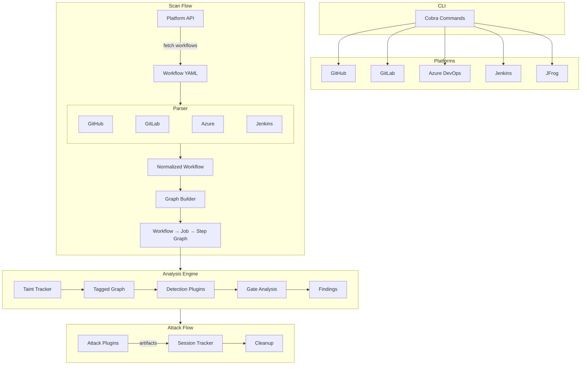

# Trajan: CI/CD Security Scanner

Trajan scans CI/CD pipelines for security vulnerabilities that attackers use to compromise software supply chains. It supports GitHub Actions, GitLab CI, Azure DevOps, Jenkins, and JFrog.

[](https://go.dev/)
[](LICENSE)

## What it does

Trajan parses workflow YAML files, builds dependency graphs, runs detection plugins, and validates exploitability through built-in attack capabilities.

- 32 detection plugins across multiple CI/CD platforms
- 24 attack plugins across multiple CI/CD platforms
- Graph-based analysis with taint tracking and gate detection
- Browser-based scanner via WebAssembly (no backend needed)
- Attack chains for multi-stage sequences with automatic context passing

> [!NOTE]
> Trajan is under active development. Some features may be incomplete and rough edges are expected. If you run into issues, please [open one](https://github.com/praetorian-inc/trajan/issues).

## Installation

Prebuilt binaries are available on the [releases page](https://github.com/praetorian-inc/trajan/releases).

```sh
go install github.com/praetorian-inc/trajan/cmd/trajan@latest
```

Or build from source:

```sh
git clone https://github.com/praetorian-inc/trajan.git
cd trajan && make build
```

### Requirements

- Go 1.24 or later
- GitHub Personal Access Token with `repo` scope (for private repositories) or `public_repo` scope (for public repositories only)

## Library SDK (`pkg/lib`)

Trajan can be embedded as a Go library for programmatic CI/CD security scanning. The `pkg/lib` package provides a public SDK that wraps Trajan's internal platform registry, detection engine, and scanner into a single high-level API.

### Quick Start (Library)

```go
import "github.com/praetorian-inc/trajan/pkg/lib"

result, err := lib.Scan(ctx, lib.ScanConfig{
    Platform:    "github",
    Token:       os.Getenv("GH_TOKEN"),
    Org:         "myorg",
    Repo:        "myrepo",
    Concurrency: 10,
    Timeout:     5 * time.Minute,
})
if err != nil {
    log.Fatal(err)
}

for _, f := range result.Findings {
    fmt.Printf("[%s] %s in %s: %s\n", f.Severity, f.Type, f.WorkflowFile, f.Evidence)
}
```

### SDK API

| Function | Description |
|----------|-------------|
| `lib.Scan(ctx, cfg)` | Full scan: platform init → workflow discovery → detection execution |
| `lib.GetPlatform(name)` | Get a platform adapter by name (`github`, `gitlab`, `azuredevops`, `bitbucket`, `jenkins`, `jfrog`) |
| `lib.ListPlatforms()` | List all registered platform names |
| `lib.GetDetections(platform)` | Get detection plugins for a specific platform |
| `lib.GetDetectionsForPlatform(platform)` | Get platform-specific + cross-platform detections |
| `lib.ListDetectionPlatforms()` | List platforms with registered detections |

### ScanConfig

```go
type ScanConfig struct {
    Platform    string        // CI/CD platform (required)
    Token       string        // API authentication token
    BaseURL     string        // Custom base URL for self-hosted instances
    Org         string        // Organization/owner name
    Repo        string        // Repository name (empty = scan all org repos)
    Concurrency int           // Parallel detection workers (default: 10)
    Timeout     time.Duration // Max scan duration (default: 5m)
}
```

### ScanResult

```go
type ScanResult struct {
    Findings  []detections.Finding   // Security vulnerabilities detected
    Workflows []platforms.Workflow   // CI/CD workflow files discovered
    Errors    []error                // Non-fatal errors during scanning
}
```

### Integration Example (Chariot Platform)

The SDK is used by the [Chariot](https://github.com/praetorian-inc/chariot) attack surface management platform to run CI/CD security scans as a capability:

```go
import trajanlib "github.com/praetorian-inc/trajan/pkg/lib"

result, err := trajanlib.Scan(ctx, trajanlib.ScanConfig{
    Platform: platformName,
    Token:    token,
    Org:      repo.Org,
    Repo:     repo.Name,
})
// Convert result.Findings → capmodel.Risk emissions
```

## Browser Support (WebAssembly)

Trajan is also available as a browser-based scanner:

```sh
# Scan a GitHub repo
export GH_TOKEN=ghp_your_token
trajan github scan --repo owner/repo

# Scan a GitHub org
trajan github scan --org myorg --concurrency 20

# Scan GitLab projects
export GITLAB_TOKEN=glpat_your_token
trajan gitlab scan --group mygroup

# Scan Azure DevOps
export AZURE_DEVOPS_PAT=your_pat
trajan ado scan --org myorg --repo myproject/myrepo

# JSON output
trajan github scan --repo owner/repo -o json > results.json
```

For detailed usage, detection explanations, and attack walkthroughs, see the [Wiki](https://github.com/praetorian-inc/trajan/wiki).

## Platform coverage

| Platform | Detections | Attacks | Enumerate |
|----------|-----------|---------|-----------|
| GitHub Actions | 11 | 9 | token, repos, secrets |
| GitLab CI | 8 | 3 | token, projects, groups, secrets, runners, branch-protections |
| Azure DevOps | 6 | 9 | token, projects, repos, pipelines, connections, agent-pools, users, groups, and more |
| Jenkins | 7 | 3 | access, jobs, nodes, plugins |
| JFrog | scan-only | - | - |

## Browser extension

Trajan also compiles to a WebAssembly binary that runs entirely in the browser as a single HTML file. It uses the same detection engine, attack plugins, and enumeration logic as the CLI, just compiled to WASM. The web version of Trajan enables low-friction delivery into target environments as part of an assessment.

```sh
make wasm       # build browser/trajan.wasm
make wasm-dist  # build self-contained trajan-standalone.html
```

## Architecture



## Roadmap

Trajan is under active development. Here's our prioritized roadmap for future features:

### High Priority (In Progress)

#### Multi-Platform Support

Currently GitHub Actions only. Expanding to other CI/CD platforms:

| Platform | Config File | Status |
|----------|-------------|--------|
| GitHub Actions | `.github/workflows/*.yml` | ✅ Complete |
| GitLab CI | `.gitlab-ci.yml` | 🔜 Planned |
| Azure DevOps | `azure-pipelines.yml` | 🔜 Planned |
| Bitbucket Pipelines | `bitbucket-pipelines.yml` | 📋 Roadmap |
| Jenkins | `Jenkinsfile` | 📋 Roadmap |
| CircleCI | `.circleci/config.yml` | 📋 Roadmap |

Each platform requires:
- API client with rate limiting
- Pipeline/workflow YAML parser
- Platform-specific plugin adaptations
- Attack plugins for platform-specific vectors

#### Attack Plugins for All Detectors

Achieving attack parity with detection capabilities:

| Detector | Attack Plugin | Status |
|----------|---------------|--------|
| `actions_injection` | `workflow-injection`, `secrets-dump` | ✅ Complete |
| `pwn_request` | `pr-attack` | ✅ Complete |
| `self_hosted_runner` | `runner-on-runner` | ✅ Complete |
| `toctou` | `toctou-race` | 🔜 Planned |
| `artifact_poisoning` | `artifact-poison` | 🔜 Planned |
| `cache_poisoning` | `cache-poison` | 🔜 Planned |
| `review_injection` | `review-inject` | 🔜 Planned |
| `unpinned_action` | `action-hijack` | 🔜 Planned |
| AI vulnerabilities (6) | `ai-prompt-inject` | 🔜 Planned |

#### Additional Attack Chains

Expanding predefined attack sequences:

| Chain | Plugins | Purpose |
|-------|---------|---------|
| `ror` | c2-setup → runner-on-runner → interactive-shell | ✅ Complete |
| `secrets` | secrets-dump | ✅ Complete |
| `persistence` | c2-setup → persistence | ✅ Complete |
| `full` | c2-setup → ror → shell → secrets → persistence | ✅ Complete |
| `ai-takeover` | ai-prompt-inject → secrets-dump → persistence | 🔜 Planned |
| `supply-chain` | artifact-poison → cache-poison → persistence | 🔜 Planned |
| `toctou-exploit` | toctou-race → workflow-injection → secrets-dump | 🔜 Planned |
| `stealth` | review-inject → persistence | 🔜 Planned |

### Medium Priority (Next Quarter)

#### Advanced Detection Features

| Feature | Description |
|---------|-------------|
| Composite action analysis | Deep analysis of reusable action internals |
| Reusable workflow analysis | Detect issues in `workflow_call` workflows |
| Environment protection bypass | Detect circumvention of deployment protections |
| Secret scope mapping | Map secret exposure across organization |
| Cross-repository analysis | Detect vulnerabilities spanning multiple repos |

#### Output & Reporting Enhancements

| Feature | Status |
|---------|--------|
| JSON output | ✅ Complete |
| SARIF output | ✅ Complete |
| Console output | ✅ Complete |
| HTML report generation | 🔜 Planned |
| JIRA integration | 📋 Roadmap |
| Linear integration | 📋 Roadmap |
| Slack notifications | 📋 Roadmap |

#### Chariot Platform Integration

- ✅ SDK library (`pkg/lib`) for embedding Trajan as a library
- ✅ Capability wrapper for Chariot job system
- ✅ Finding → Risk translation layer
- Unified dashboard integration

### Lower Priority (Future)

#### Performance & Scale

| Feature | Benefit |
|---------|---------|
| GraphQL batch queries | 5x improvement for large organizations |
| Result caching | Avoid re-parsing unchanged workflows |
| Distributed scanning | Multi-node scanning for massive orgs |
| Incremental scanning | Only scan changed workflows since last run |

#### Additional Platforms

- Travis CI (`.travis.yml`)
- Drone CI (`.drone.yml`)
- Tekton Pipelines
- AWS CodePipeline
- Google Cloud Build

## Contributing

See [CONTRIBUTING.md](CONTRIBUTING.md) for development guidelines, plugin authoring, and project structure.

## Acknowledgements

Built on research from [Gato](https://github.com/praetorian-inc/gato), [Glato](https://github.com/praetorian-inc/glato), [Gato-X](https://github.com/AdnaneKhan/gato-x) by Adnan Khan, and the [GitHub Security Lab](https://securitylab.github.com/research/).

## License

Apache 2.0. See [LICENSE](LICENSE).

