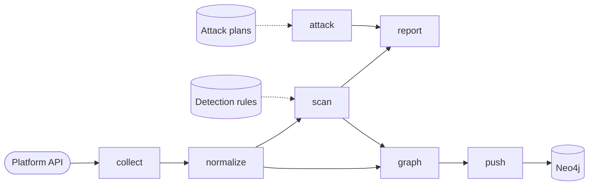

# Trajan: CI/CD Security Scanner

Trajan scans CI/CD pipelines for security vulnerabilities that attackers use to compromise software supply chains. It supports GitHub, GitLab, and Azure DevOps, with more platforms under development.

[](https://go.dev/)
[](LICENSE)

> [!NOTE]
> Trajan is under active development. Some features may be incomplete. If you hit issues, please [open one](https://github.com/praetorian-inc/trajan/issues).

## Installation

Prebuilt binaries are on the [releases page](https://github.com/praetorian-inc/trajan/releases).

From source (Go 1.25+):

```sh
git clone https://github.com/praetorian-inc/trajan.git
cd trajan && make build   # writes ./bin/trajan
```

### Browser (WASM)

```sh
make wasm-serve   # http://localhost:8080
```

Runs collect → normalize → scan in the browser and renders the same HTML report as the CLI. Attack and graph are not included. See [browser/README.md](browser/README.md).

## Usage

### Credentials

Credentials resolve in order. The first non-empty value wins.

| Platform | Order |
|---|---|
| GitHub | `TRAJAN_GH_TOKEN`, `GH_TOKEN`, `GITHUB_TOKEN`, `--token` |
| GitLab | `TRAJAN_GL_TOKEN`, `GITLAB_TOKEN`, `GL_TOKEN`, `CI_JOB_TOKEN`, `--token` |
| Azure DevOps | `TRAJAN_ADO_TOKEN`, `ADO_PAT`, `AZURE_DEVOPS_PAT`, `AZDO_PAT`, `AZURE_DEVOPS_EXT_PAT`, `AZURE_BEARER_TOKEN`, `SYSTEM_ACCESSTOKEN`, `--token`, `--azure-bearer-token` |

`AZURE_BEARER_TOKEN` / `SYSTEM_ACCESSTOKEN` / `--azure-bearer-token` are Entra ID or pipeline bearers. The rest are PATs.

### Run a scan

```sh
export TRAJAN_GH_TOKEN=ghp_...
trajan github whoami
trajan github run your-org/your-repo
trajan github report --format html

export TRAJAN_GL_TOKEN=glpat-...
trajan gitlab run your-group

export TRAJAN_ADO_TOKEN=...
trajan ado run your-org/your-project
```

Locators:

- GitHub: `owner/repo` or `org` (bare, or a github.com / GHES URL)
- GitLab: group, subgroup, or project path
- Azure DevOps: `<org>`, `<org>/<project>`, or `<org>/<project>/<repo>`

Each run writes under `./trajan-out/` (override with `--output-dir`). Phases read prior phase output. You can re-run a phase without another API trip. `--concurrency` bounds API workers.

Root flags:

- `--debug` for raw structured logs
- `--no-color`
- `--proxy` / `--socks-proxy` for intercepting proxies

## What Trajan does

Trajan collects CI/CD configuration read-only. It evaluates detection rules and reports findings. On GitHub it can also verify findings with authorized attack plans. Detections and attack plans are YAML. No Go required to add either.

### Detections

Pipeline per run:

1. **collect**: raw API responses
2. **normalize**: typed facts
3. **scan**: rule evaluation over those facts
4. **report**: findings as json, jsonl, md, or html

Rule counts today: 301 total (94 GitHub, 141 GitLab, 66 Azure DevOps). One evaluation engine. Rules live in `internal/detection-rules/<platform>/`.

A rule is a YAML file. It names a subject, a `where` predicate, evidence lines, and a fix hint:

```yaml
id: cat-01/issue-comment-checkout
subject: job
severity: critical

where:
  all_of:
    - triggers ∋ {issue_comment}
    - has_checkout_of_pr_ref == true
    - executes_checked_out_code == true
  none_of:
    - if_conditions_summary.gate_strength == "strong"

evidence:
  - "issue_comment job checks out PR head and runs code from it."
  - "Gate strength: {{ if_conditions_summary.gate_strength }}"

remediation_hint: >
  Require author-association == OWNER or an explicit maintainer list.
```

DSL notes:

- `where` is a predicate string, or nested `all_of` / `any_of` / `none_of`
- `chain_of` correlates across subjects
- Comparisons: `==`, `!=`, `>`, `>=`, `<`, `<=`, `∋`, `⊆`, `matches`, `in`
- `{{ ... }}` interpolates matched fields into evidence

New facts belong in normalize. Rules only read them. A rule change needs no new API calls.

### Graph

> [!IMPORTANT]
> Graph is **GitHub only** today. Other platforms are coming soon.

`graph:` on a rule attaches findings to nodes and edges. Normalized facts and findings become a graph of repositories, workflows, jobs, secrets, runners, environments, and more.

```sh
trajan github graph
trajan github push --neo4j-pass <pass> --reset
```

Output lands in `30-graph/{nodes,edges}.json`. Push loads Neo4j at `bolt://localhost:7687`. From there you can ask questions Trajan has no rule for, in Cypher.

### Attack

> [!IMPORTANT]
> Attack / verification is **GitHub only** today.

Attack runs a bounded, authorized check against the customer's own system. It proves whether a finding is exploitable.

Plans are YAML under `internal/attack-plans/`. Steps are primitives (`repo.fork`, `pr.open`, `run.harvest`, and so on). Payloads come from reusable job templates under `internal/attack-payloads/`. There are 15 templates today: injection carriers, checked-out code execution, secret reachability, OIDC claims, and more.

Example shape:

```yaml
apiVersion: trajan.attack/v1
title: Issue-comment injection
rule: cat-01/issue-comment-checkout
scope: [your-org/your-repo]
identity: store:assessor

steps:
  - id: target
    uses: repo.resolve
    owner: your-org
    repo: your-repo
  - id: comment
    uses: comment.create
    on: issue
    template: t-08/expression-injection
    params: { marker: comment-inject }
  - id: loot
    uses: run.harvest
    on: run
```

Safety defaults:

- `attack run` is dry-run until `--execute`
- Nothing touches a target outside `scope`
- Credentials are references only (literals in plan text fail validation)
- Cleanup is ledger-backed and replayable

```sh
trajan github attack plan list
trajan github attack plan validate github/pwn-request
```

See the embedded plans in `internal/attack-plans/github/` for full examples (`pwn-request`, `comment-injection`, `cache-poison`, `stale-approval`).

## Architecture


```mermaid
flowchart LR
  API([Platform API]) --> Collect[collect]
  Collect --> Normalize[normalize]
  Normalize --> Scan[scan]
  Scan --> Report[report]

  Rules[(Detection rules)] -.-> Scan
  Plans[(Attack plans)] -.-> Attack

  Normalize --> Graph[graph]
  Scan --> Graph
  Attack[attack] --> Report
  Graph --> Push[push] --> Neo4j[(Neo4j)]
```

Solid arrows are data flow. Dotted arrows are the YAML corpora that drive a phase.

## Platforms

| Platform | Detections | Graph | Verification |
|---|---|---|---|
| GitHub | yes | yes | yes |
| GitLab | yes | coming soon | coming soon |
| Azure DevOps | yes | coming soon | coming soon |
| Bitbucket | coming soon | - | - |
| Jenkins | coming soon | - | - |
| JFrog | coming soon | - | - |

## Contributing

See [CONTRIBUTING.md](CONTRIBUTING.md) for setup, layout, and how to add detections or platforms.

Detection rules are YAML under `internal/detection-rules/`. Drop a file in the right category directory and it is embedded on the next build.

## Acknowledgements

Built on research from our prior work on [Gato](https://github.com/praetorian-inc/gato) and [Glato](https://github.com/praetorian-inc/glato).

## License

Apache 2.0. See [LICENSE](LICENSE).
