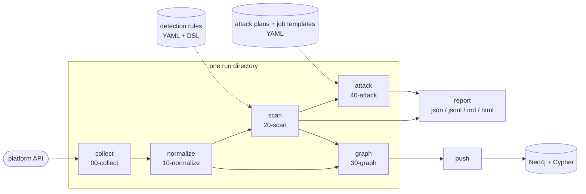

# Trajan: CI/CD Security Scanner

Trajan scans CI/CD pipelines for security vulnerabilities that attackers use to compromise software supply chains. It supports GitHub Actions, GitLab CI, Azure DevOps, Jenkins, and JFrog.

[](https://go.dev/)
[](LICENSE)

> [!NOTE]
> Trajan is under active development. Some features may be incomplete and rough edges are expected. If you run into issues, please [open one](https://github.com/praetorian-inc/trajan/issues).

## Quick start

Prebuilt binaries are on the [releases page](https://github.com/praetorian-inc/trajan/releases); building from source is below. Credentials come from the environment — for GitHub, a PAT with `repo` scope, or `public_repo` for public repositories only.

```sh
export TRAJAN_GH_TOKEN=ghp_...
trajan github whoami                  # the identity and scopes behind the token
trajan github run your-org/your-repo  # collect, normalize, scan
trajan github report --format html    # writes findings.html into the run directory

export TRAJAN_GL_TOKEN=glpat-...
trajan gitlab run your-group          # group, subgroup, or project path
export TRAJAN_ADO_TOKEN=...
trajan ado run your-org/your-project  # <org>, <org>/<project>, or <org>/<project>/<repo>
```

A GitHub locator is `owner/repo` or `org`, bare or as a github.com / GitHub Enterprise Server URL. Each run gets its own directory under `./trajan-out/` (`--output-dir` moves it, `--concurrency` bounds the API workers), and every phase reads only what an earlier one wrote, so any phase can be re-run against saved state without a second trip to the API.

Each platform's conventional variables are honored too (`GH_TOKEN`, `GITHUB_TOKEN`, `GITLAB_TOKEN`, `ADO_PAT`, `AZURE_DEVOPS_PAT`, and the rest), and `--token` on a subcommand takes a credential where an exported secret is unwanted. Root flags apply everywhere: `--debug` for raw structured logs, `--no-color`, and `--proxy` / `--socks-proxy` to route traffic through an intercepting proxy. Trajan also runs as a composite [GitHub Action](.github/GITHUB_ACTION.md).

<details><summary>Build from source</summary>

```sh
git clone https://github.com/praetorian-inc/trajan.git
cd trajan && make build   # Go 1.25 or later; writes ./bin/trajan
```
</details>

## What Trajan does

Trajan collects a CI/CD estate read-only, evaluates a rule corpus over it, and reports the weaknesses it finds. On GitHub it will then verify a finding against the system it came from, so the report says "this was measured" rather than "this configuration looks wrong". Both halves are YAML: adding either takes no Go.

### Detections

Three phases per run — `collect` writes raw API responses, `normalize` turns them into explicit typed facts, `scan` evaluates the rule corpus over those facts and writes findings, so a rule change costs no API calls. A detection is a YAML file and nothing else: 301 of them today, 94 for GitHub Actions, 141 for GitLab CI, 66 for Azure DevOps, over one evaluation engine. A rule names its subject, a `where` block in a small predicate DSL, the evidence sentences that reach the report, and the fix (`description:` elided here):

```yaml
id: cat-01/issue-comment-checkout
scenario_id: cat-01/10
title: "issue_comment chatops checks out PR ref and executes it"
subject: job
graph: attack(PWN_REQUEST)
severity: critical
confidence: high

where:
  all_of:
    - triggers ∋ {issue_comment}
    - has_checkout_of_pr_ref == true
    - executes_checked_out_code == true
  none_of:
    - if_conditions_summary.gate_strength == "strong"

evidence:
  - "issue_comment job checks out PR head and runs code from it."
  - "Gate strength: {{ if_conditions_summary.gate_strength }}"

remediation_hint: >
  Require author-association == OWNER or compare against an explicit maintainer
  list; do not gate on a substring match of the comment body alone.
```

`where` is a predicate string or a nestable `all_of` / `any_of` / `none_of` combinator; `chain_of` correlates across subjects for the 46 rules that follow taint between jobs. Predicates read normalized fields by path and compare with `==`, `!=`, `>`, `>=`, `<`, `<=`, set containment `∋`, subset `⊆`, `matches` for a regex, and `in`. `{{ ... }}` interpolates the fields that matched, so the report explains itself, and every finding carries the rule id, the DSL that fired as authored, a stable fingerprint, and the remediation hint. Rules live in `internal/detection-rules/<platform>/`; new facts belong in `normalize`, and rules only read them.

### Graph

A rule's `graph:` line names the node or edge its findings attach to. `graph` turns normalized facts and findings into nodes and edges — `Repository`, `Workflow`, `Job`, `Secret`, `Runner`, `Environment`, `Ruleset`, `App`, `CloudRole`, `ExternalActor` and more, joined by `READS`, `WRITES`, `CAN_LAND_CODE`, `CAN_APPROVE`, `CAN_ASSUME`, `MINTS_TOKEN_AS`, `PWN_REQUEST` and the rest of the vocabulary in `internal/graph/schema.go`.

`trajan github graph` writes `30-graph/{nodes,edges}.json` and `trajan github push --neo4j-pass <pass> --reset` loads them into Neo4j at `bolt://localhost:7687`. From there the questions Trajan ships no rule for are Cypher you write yourself: which external actor reaches a production secret, which job on a shared runner is reachable from a fork. GitHub only today.

### Attack

Verification runs a bounded, authorized check against the customer's own system to establish whether a finding is actually exploitable. It composes 40 primitives — one irreducible step each: `repo.fork`, `ref.create`, `commit.code`, `pr.open`, `run.observe`, `run.harvest` — into flat YAML plans. Handles pass between steps by name, and the registry knows from Go types which bindings are legal, so `attack plan validate` reports every error in a plan at once, offline, having issued zero requests. What a step commits into the target comes from a corpus of 15 job templates with declared parameter schemas, shared across plans. Below, the comment block is elided and the target and identity names are placeholders:

```yaml
apiVersion: trajan.attack/v1
title: Issue-comment injection into a default-branch workflow
rule: cat-01/issue-comment-checkout
scope: [your-org/your-repo]
identity: store:assessor

steps:
  - id: target
    uses: repo.resolve
    owner: your-org
    repo: your-repo
  - id: issue
    uses: issue.open
    repo: target
    title: "docs: clarify build step"
    body: "Tracking a docs tweak."
  - id: comment
    uses: comment.create
    on: issue
    template: t-08/expression-injection
    params: { marker: comment-inject }
  - id: run
    uses: run.observe
    on: target
    workflow: .github/workflows/triage.yml
    match: comment-inject
  - id: loot
    uses: run.harvest
    on: run

cleanup:
  - { uses: comment.delete, id: cleanup-comment, comment: comment }
```

The plan's `rule:` field names the detection it verifies, and the finding it produces lands in the same report as that detection. Runs are inert by default: `attack run` renders exactly what would be sent and sends no mutation until `--execute`, and passing `--execute` is the operator's authorization assertion, recorded in the run record. Nothing touches a target outside the plan's `scope` allowlist. The inverse of every change is written to a ledger before the call that needs it, so a process killed mid-run still leaves a replayable undo record, and `attack cleanup` replays it and reports what was reversed, what was partial, and what cannot be undone. Credentials are reference-only: a literal in plan text is a validation error, because plans are committed to this repository. GitHub only today.

```sh
trajan github attack plan list                          # the embedded plan corpus
trajan github attack plan validate github/pwn-request   # offline, zero requests
```

## Architecture


```mermaid
flowchart LR
  subgraph rundir["one run directory"]
    direction LR
    C[collect<br/>00-collect] --> N[normalize<br/>10-normalize] --> S[scan<br/>20-scan]
    N & S --> G[graph<br/>30-graph]
    S --> A[attack<br/>40-attack]
  end
  API([platform API]) --> C
  R[(detection rules<br/>YAML + DSL)] -.-> S
  P[(attack plans + job templates<br/>YAML)] -.-> A
  S & A --> RPT[report<br/>json / jsonl / md / html]
  G --> PU[push] --> DB[(Neo4j + Cypher)]
```

Solid arrows are data; dotted arrows are the YAML corpora that drive a phase.

## Platforms

| Platform | Detections | Graph | Verification |
|---|---|---|---|
| GitHub Actions | yes | yes | yes |
| GitLab CI | yes | coming soon | coming soon |
| Azure DevOps | yes | coming soon | coming soon |
| Jenkins | coming soon | — | — |
| JFrog | coming soon | — | — |

Jenkins and JFrog are roadmap entries: there is nothing to run against them today.

## Contributing

Detections are YAML under `internal/detection-rules/`; conventions are in [AGENTS.md](AGENTS.md).

## Acknowledgements

Built on research from [Gato](https://github.com/praetorian-inc/gato), [Glato](https://github.com/praetorian-inc/glato), [Gato-X](https://github.com/AdnaneKhan/gato-x) by Adnan Khan, and the [GitHub Security Lab](https://securitylab.github.com/research/).

## License

Apache 2.0. See [LICENSE](LICENSE).
