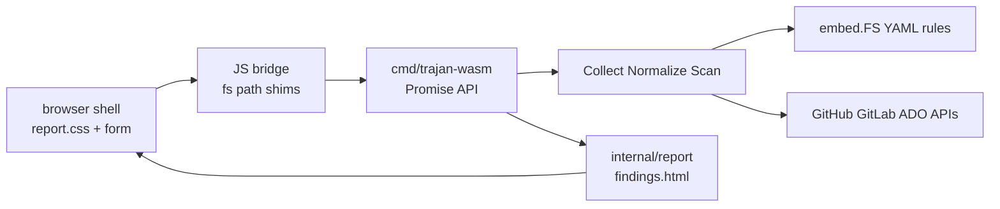

# WASM Browser Scanner Rebuild

## Goal

Ship a browser-runnable Trajan that runs the current YAML detection pipeline (GitHub, GitLab, Azure DevOps), shows results in the same self-contained HTML report look used by the CLI / GitHub Action, and does **not** include attack or graph.

## Context (what existed and why it died)

- Old stack lived under `browser/` + `cmd/trajan-wasm`, introduced in the initial public release, retired in PR #136 (`da1cf68` / landed on `main` via #135).
- It used Go plugins (`pkg/detections` + `scanner.DetectionExecutor`), not YAML under `internal/detection-rules`.
- ADO needed `browser/server.go` `/azdo-proxy/` because browser `fetch` hit CORS; GitHub/GitLab did not.
- Packaging: `make wasm-dist` inlined CSS/JS/`wasm_exec.js` and base64-embedded `trajan.wasm` into one `trajan-standalone.html`.
- Broken after attack exports were removed while `bridge.js` still required them — page threw on load.

Do **not** revive that SPA (Validate / Recon / Attack / Shell tabs). Rebuild against `internal/`.

## Product scope

| In | Out |
|----|-----|
| Collect → normalize → scan (YAML rules) for GitHub, GitLab, ADO | `internal/attack` |
| Report HTML (same assets as CLI/Action) | `internal/graph` / Neo4j |
| Token + platform + scope inputs, run, progress, cancel | Legacy `pkg/scanner` / Go detectors |
| Self-contained HTML artifact | Persisting PATs in `localStorage` |

Rules stay first-party via existing `//go:embed` in `internal/detection-rules/embed.go` (~301 rules across github/gitlab/ado).

## Architecture



**Runtime model (chosen):**

1. In-memory JS `fs` + `path` shims (~150 lines) so the unmodified on-disk `runDir` contract works. Empirically validated: `Scan` + `report.Run(html)` already succeed under browser conditions with this shim; no Go IO rewrite needed.
2. Absolute `OutputDir` (e.g. `/run`) — browser `os.Getwd` is `ENOSYS`.
3. WASM `scan` mirrors CLI `run` (thread `runDir` in Go; do not call `ResolveRunDir`).
4. Results UI: after scan, call `report.Run(..., format: html)`, read `findings.html` from the shim FS, inject into the page (iframe `srcdoc` or replace `#results`). Zero drift from `internal/report/assets/`.
5. Shell chrome (form + progress) sits **above** that report; copy masthead / tiles / cards / filters / theme from the report assets — do not invent a second visual language.
6. Exclude attack/graph by not importing them from the WASM `main` (linker drops them). ~21 MB raw / ~5 MB gzip for three platforms + report.

## UI design

Reuse as-is from `internal/report/assets/report.css`, `report.html`, `report.js`:

- CSS variables, severity tiles, sticky sidebar filters, finding cards, light/dark theme, print styles.
- GitHub Action job summary Markdown is **not** the look — only the HTML report is.

Add above the report mount:

- Platform: `github` | `gitlab` | `ado`
- Token (password field; memory-only, no `localStorage`)
- Scope / locator (same strings as CLI: `org/repo`, group, `org/project`, or HTTPS URL)
- Optional GitLab base URL (self-hosted)
- Optional ADO org URL when needed
- Run / Cancel
- Progress log (phases + soft errors / degraded), wired from `slog` → `onLog`

Idle state: form + empty dashed panel (same empty-run treatment as the report). After scan: inject the full self-contained report document into `#results`.

## JS ↔ Go API (minimal)

Every export returns a `Promise`; work runs in a goroutine (blocking `js.FuncOf` deadlocks fetch).

```javascript
trajan.initialize({ outputDir: "/run", concurrency, onLog })
trajan.whoami({ platform, token, baseUrl })   // structured; adapt print-only WhoAmI
trajan.scan({ platform, locator, token, baseUrl, orgOnly })
trajan.report({ runDir, format: "html"|"jsonl"|"md", minSeverity, minConfidence })
trajan.cancel()
trajan.version()
```

No `configGet`/`configSet`, no attack, no enumerate/search leftovers from the old bridge.

## Azure DevOps / CORS

Old assumption (“ADO has no ACAO”) looks stale: live OPTIONS probes show `dev.azure.com` and `vssps.dev.azure.com` advertising `ACAO: *` + `authorization`. GitHub and GitLab cloud already work via fetch.

**Plan:** ship **without** a required localhost proxy. Before release, live-test a real ADO PAT across all six `hostBase` hosts in `internal/ado/client.go`. If any host fails CORS or opaque redirect-to-login:

- Reintroduce a thin allowlisted reverse proxy (pattern from deleted `browser/server.go`: host allowlist, strip `Www-Authenticate`, same-origin only).
- Repoint `hostBase` (already a `var` for tests) rather than re-adding `WithHTTPTransport` to `internal/` clients.

Self-hosted GitLab without CORS is the more likely proxy case; document “cloud works file:// or static host; self-hosted / broken-CORS needs `wasm-serve`.”

## Packaging and build

Restore Makefile targets (names can match history):

- `wasm` — `GOOS=js GOARCH=wasm go build -o browser/trajan.wasm ./cmd/trajan-wasm` + copy GOROOT `wasm_exec.js`
- `wasm-serve` — static server for multi-file dev (proxy only if ADO/self-hosted verification requires it)
- `wasm-dist` — single `browser/trajan-standalone.html` (inline CSS/JS/`wasm_exec.js`/`bridge.js`/`app.js`, base64 WASM)

New tree (leaner than the old multi-tab SPA):

- `cmd/trajan-wasm/` — `main.go` + `api.go` (`//go:build js`)
- `browser/` — `index.html`, `styles` (report.css + thin shell), `app.js`, `bridge.js`, `fs-shim.js`, optional `server.go`

Do not resurrect `pkg/config` / `pkg/storage` IndexedDB token stores.

## Go changes (small)

Prefer zero pipeline changes. Likely touch points:

1. `cmd/trajan-wasm` only imports `internal/{engine,engine/detect,github,gitlab,ado,report,finding,dsl,ui}` — never attack/graph.
2. Structured `WhoAmI` return for the bridge (CLI today prints).
3. `slog` / UI writer: bridge logs to `onLog` (call `slog.SetDefault` after `ui.Init`, or widen `ui.Init` if needed).
4. GitLab insecure TLS: hard-error in WASM (fetch ignores `InsecureSkipVerify`).
5. Optional later: exported in-memory `report.Render` — start by reading shim FS after `report.Run`.

## Implementation order

1. Write `plan.md` (this document).
2. JS `fs` + `path` shims + smoke harness (scan/report against fixture or live token).
3. `cmd/trajan-wasm` Promise API (initialize / whoami / scan / report / cancel / version).
4. Browser shell: form + progress + inject `findings.html` using report assets.
5. Live CORS verification for ADO (and document proxy fallback if needed).
6. `wasm` / `wasm-dist` / optional `wasm-serve`; wire GoReleaser artifact when ready.
7. Short `browser/README.md` (how to build, token handling, platform notes). Keep root README mention brief.

## Explicit non-goals

- Attack plans / primitives in the browser
- Graph / Neo4j from the browser
- Parity with old recon/enumerate/shell/search tabs
- Storing customer PATs in `localStorage` or IndexedDB
- Rewriting the phased engine to pure in-memory Go APIs in v1
